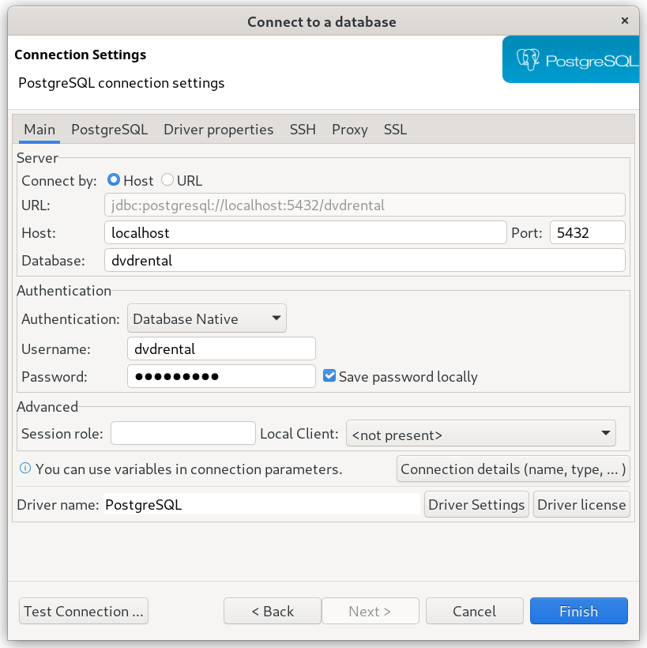

# DVD Rental

A containerized example using [PostgreSQL][postgres] and the
[dvdrental][dvdrental] sample database.

[postgres]: https://www.postgresql.org/
[dvdrental]: https://www.postgresqltutorial.com/postgresql-getting-started/postgresql-sample-database/

Run the server:

~~~
podman run -p 5432:5432 --rm -it quay.io/ssorj/dvdrental
~~~

Connect a client:

~~~
PGPASSWORD=dvdrental psql -h localhost dvdrental dvdrental
~~~

Use `\dt` to list the database tables.  Use `select * from <table>;`
to explore the data.  Use `\h` for help.  Use `\q` to quit.

Connection parameters:

~~~
Host:     localhost (or wherever you end up exposing it)
Port:     5432
Database: dvdrental
Username: dvdrental
Password: dvdrental
~~~

Here's what that looks like connecting with
[DBeaver](https://dbeaver.io/):

